# Live Flight Tracker Demo
<!-- TOC -->

- [Live Flight Tracker Demo](#live-flight-tracker-demo)
  - [Architecture of the demo](#architecture-of-the-demo)
  - [Step by Step to Deploy Live Flight Tracker on OpenShift](#step-by-step-to-deploy-live-flight-tracker-on-openshift)

<!-- /TOC -->
## Architecture of the demo


- map-service: web application with websocket, rest api for interact with browser for show and receive command for simulate live flight tracker
- postgresql: relational database for airport data
- data-simulator: backend service for simulation live flight (simulate radar data and transponder data to kafka)
- kafka broker: messaging system for integrate data between system
- data-aggregator: streams processing service for aggregate (merge) radar data and transponder data to flight data and put it back to kafka for display from map service

## Step by Step to Deploy Live Flight Tracker on OpenShift


1. Create Project for Live Flight Tracker
   - open openshift developer perspective, click  "Project" from left menu, click "create a Project"
   
      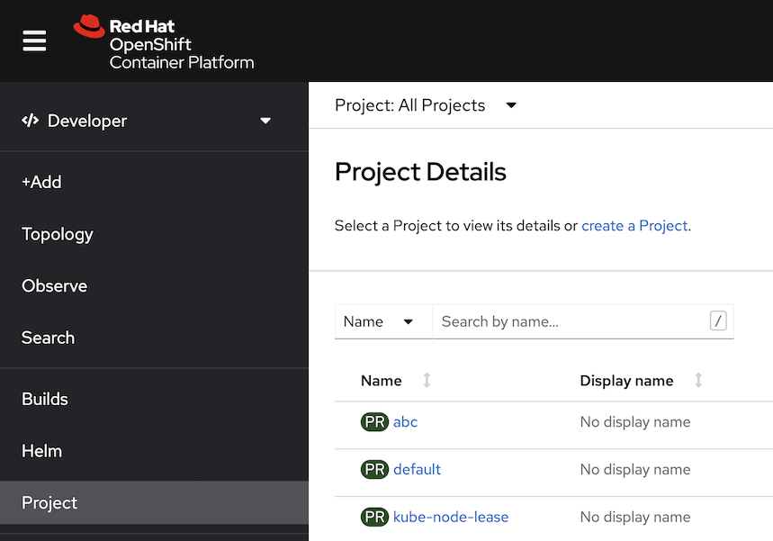

   - in create project panel, 
     - set Name: <username>-flight such as "user1-flight"
     - click "create"
  
      

2. Create Kafka on OpenShift
   - click Topology in left menu
  
   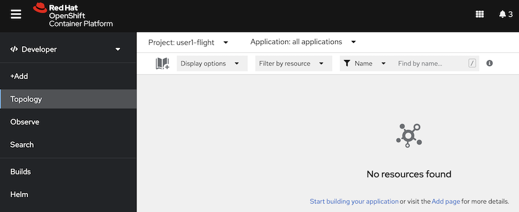

   - click add icon (book with plus sign, right top, near Display options)
   - type "kafka" in search box, select "Kafka" and click Create
  
      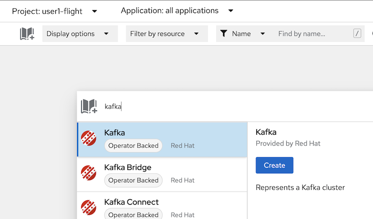

   - in Create Kafka, leave all default, click create
      
      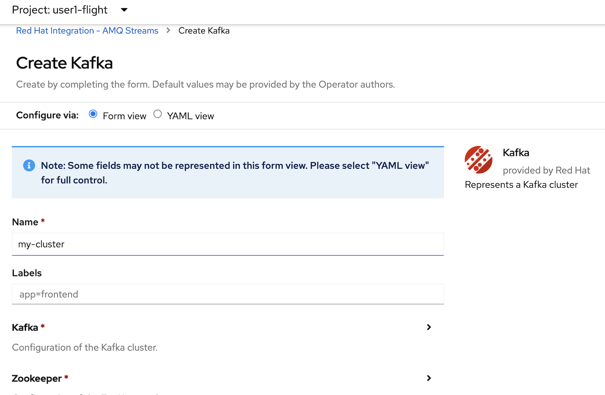
   
   - wait until kafka complete deployment, you will see 3 deployment in kafka "my-cluster" (wait until all 3 deployment circle change to dark blue)
   
      

3. Create Topic in kafka
   - in Topology, click add icon (book with plus sign, right top, near Display options)
   - type "topic", select Kafka Topic, click Create
      
      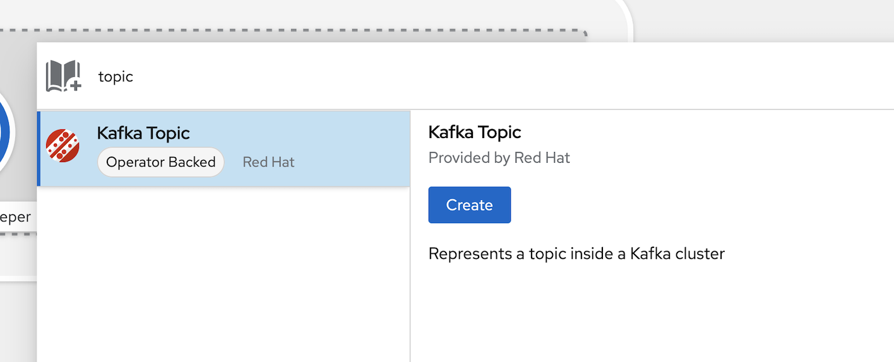
   
   - in create kafkatopic panel, 
   - change Name to "flight-data"
   - leave other to default, click create
      
      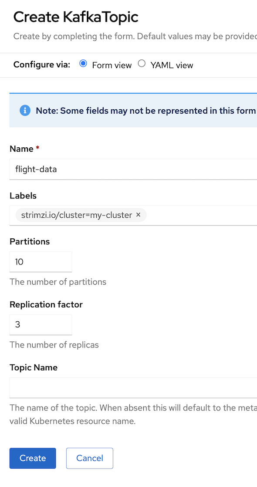
   - repeat create kafkatopic with name "radar-data" and "transponder-data"
   - check kafkatopic, in Topology, in my-cluster kafka, click on my-cluster-kafka statefulset (see example in below picture)
      
      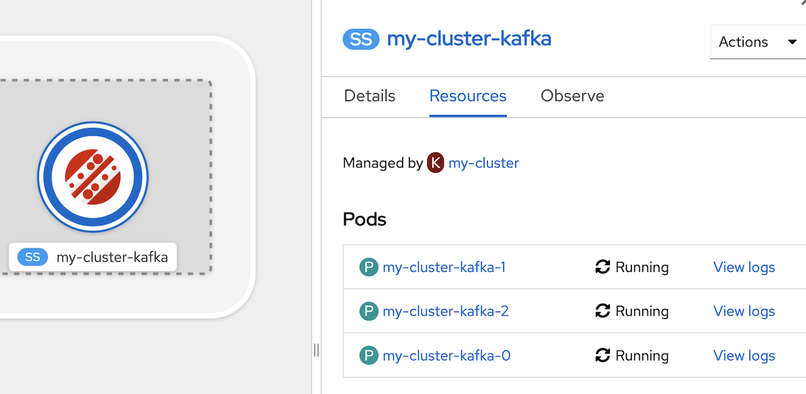
   
   - in right panel popup, click in Resources tab, in Pods section, click view logs link in first pod (such as my-cluster-kafka-0)
   - after page change to Pod information page, change tab from Logs to Terminal
   - openshift will open terminal to pod, in terminal type below commond to check topic in kafka (flight-data, radar-data, transponder-data)
   
      
     
     ```bash
     ./bin/kafka-topics.sh --bootstrap-server=localhost:9092 --list
     ```

     sample output (if you create correct!)
     
     ```bash
     __consumer_offsets
     __strimzi_store_topic
     flight-data
     radar-data
     transponder-data
     ```

     Alternatively, you can also use Web Terminal with following command to check for topic

     ```bash
     oc describe kafkatopic/flight-data -n <username>-flight
     ```

     sample output
      
     ```yaml
      ...
      Spec:
      Config:
         retention.ms:   604800000
         segment.bytes:  1073741824
      Partitions:       10
      Replicas:         3
      Topic Name:       flight-data
      Status:
      Conditions:
         Last Transition Time:  2022-08-24T11:08:29.292182Z
         Status:                True
         Type:                  Ready   
      ...
     ```


4. Create Database Postgresql
   - click +Add in left menu, in Developer Catalog, select Database
   
      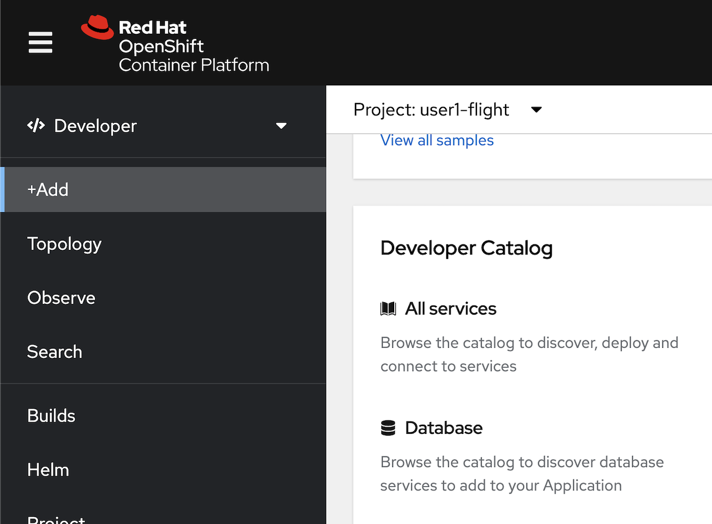
   
   - type "postgresql" in search box, select PostgreSQL (Ephermeral)
      
      
   - click Instantiate Template
      
      
   
   - In Instantiate Template page, set value
     
     - leave all default except,
  
         | Parameter        | Value  |
         | ------------- |:-------------|
         |Database Service Name| postgresql|
         |Connection Username| postgresql|
         |Conneciton Password| postgresql|
         |Database Name| postgresql|

     - click create
      
      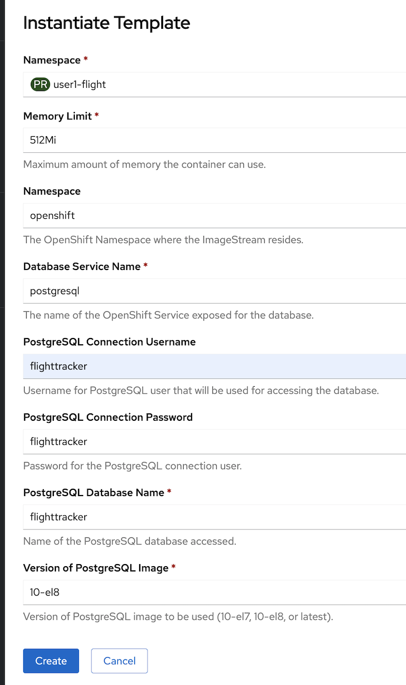

   - wait until postgresql change to dark blue circle
  
      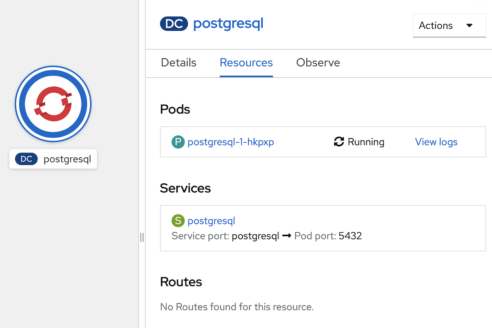
   
   - Optional: Change PostgreSQL icon
     - Right click on PostgreSQL icon
     - Select Edit labels
     - Add *app.openshift.io/runtime=postgresql*
      
      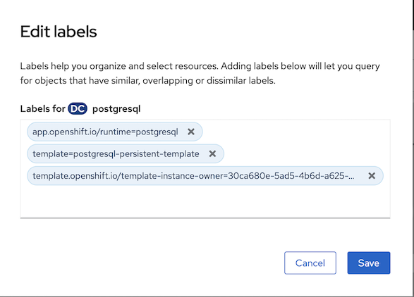
      
      Icon will change to PostgreSQL

      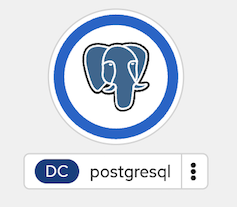

5. Deploy Data-Aggregator from Container Image
   - click +Add left menu, select Container images
   
      

   - in deploy image page, 
     - select Image name from external registry
     - type "quay.io/chatapazar1/data-aggregator"
     - runtime icon: change to quarkus
     - Application: select Ceate Application
     - Application Name: "flight-data-aggregator"
     - Name: "flight-data-aggregator"
     - resource: Deployment
     - target port: 8080
     - uncheck create a route to the application
     - click create
      
      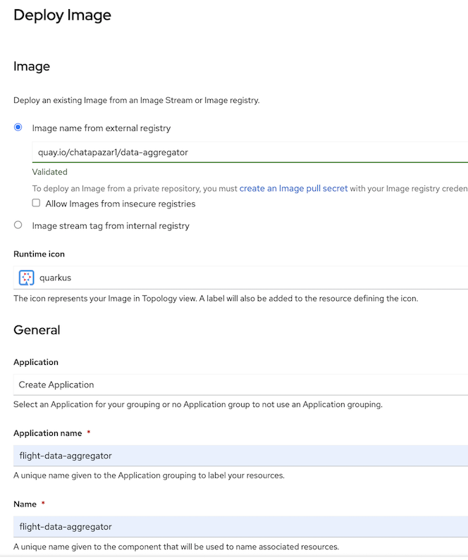
      
      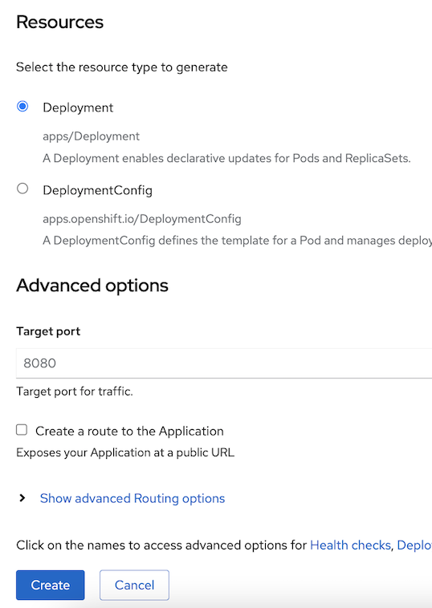

   - wait until flight-data-aggregator circle change to dark blue color
      
      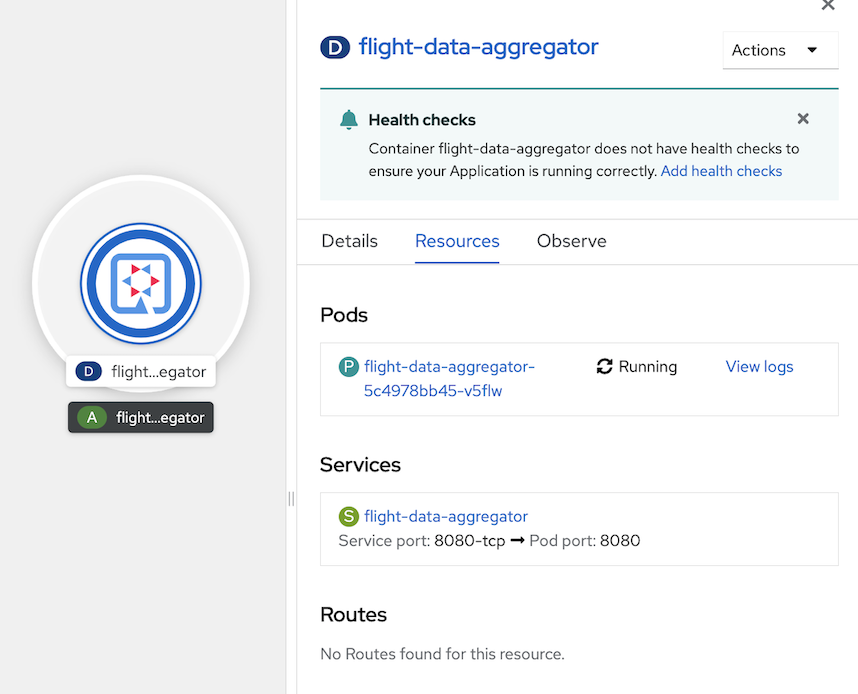
   
   - click flight-data-aggregator, select resources tab, click view logs in first port
      
      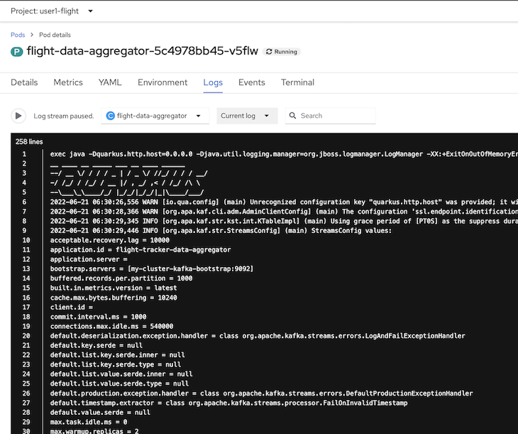

   - openshift console will display log of flight-data-aggregator, Verify that there are no errors
6. Deploy Data-Simulator from Git Repository (S2I/OpenShift Build)
   - click +Add in left menu
      
      
   
   - in Import from Git page, set Git Repo URL to : https://github.com/chatapazar/openshift-workshop.git
   - click show advanced git options
   - set Context dir to : /data-simulator
   - select Import Strategy to Builder Image
      
      

   - select Java
   - select Builder Image version to : openjdk-11-ubi8
   - in General, Application, select Create Application
   - set Application name to : flight-data-simulator
   - set name to : flight-data-simulator
   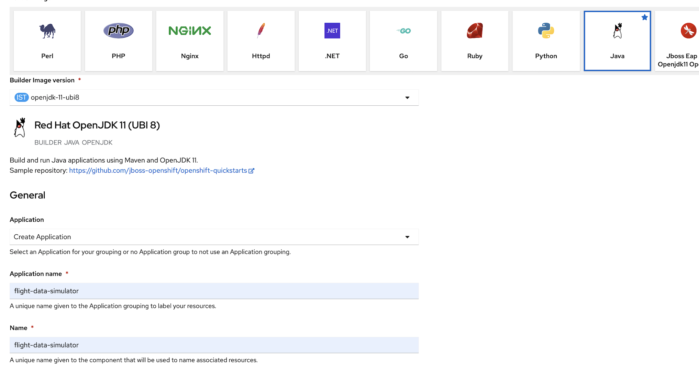
   - in resources, select deployment
   - in advanced options, leave default target port
   - uncheck create a route to the application and click Create
   
   - in Topology view, click circle "(D) flight-data-simulator" for show deployment information popup in right side of developer console
   - in flight-data-simulator information page, click Resources tab, scroll down to Builds section, wait until Build #1 was complete or click View logs for view s2i build your code to container image
   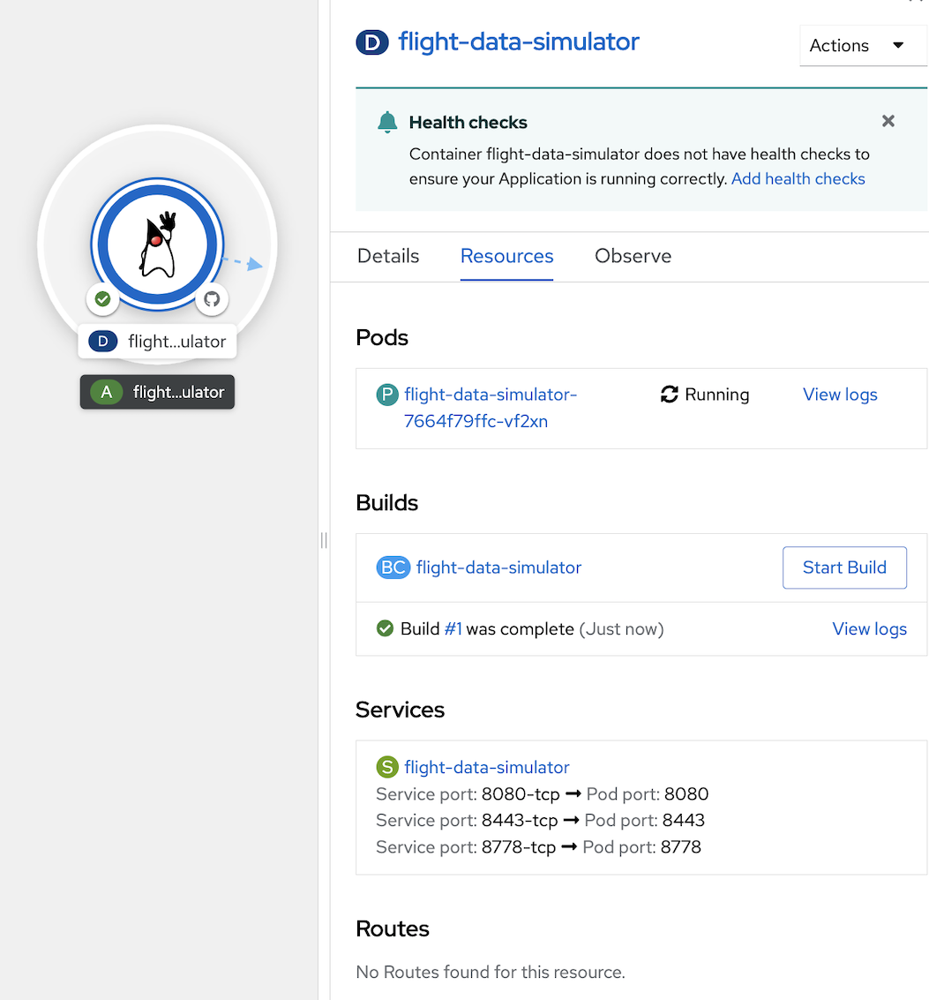
   - after build complete, flight-data-simulater circle will change to dark blue color, click view logs in Pods section to view application log, Verify that there are no errors
   
7. Deploy Map-Service from Git Repository (S2I/OpenShift Build)
   - click +Add in left menu, select Import from Git
   - in Import from Git page, set Git Repo URL to : https://github.com/chatapazar/openshift-workshop
   - click show advanced Git options
   - set Context dir to : /map-service
   - Import Strategy select Builder Image, 
   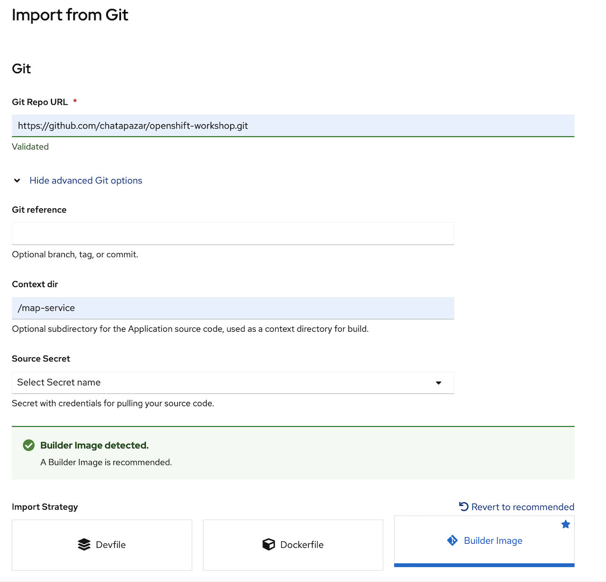
   - select Java,
   - set Builder Image version to : openjdk-11-ubi8
   - Application set to Create Application
   - Application name: flight-map-service
   - Name: flight-map-service
   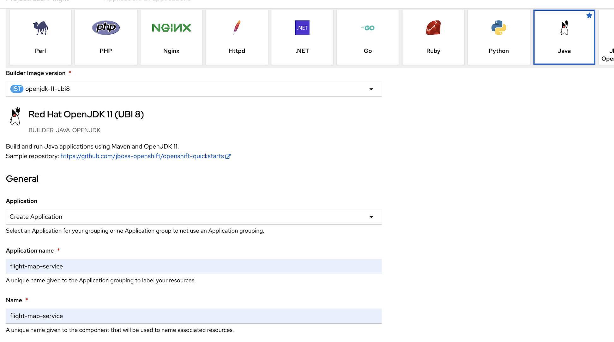
   - in resources section, select deployment, leave default target port 8080
   - uncheck Create a route to the Applicaiton, click Create
   
   - in Topology view, click circle "(D) flight-map-service" for show deployment information popup in right side of developer console
   - in flight-map-service information page, click Resources tab, scroll down to Builds section, wait until Build #1 was complete or click View logs for view s2i build your code to container image
   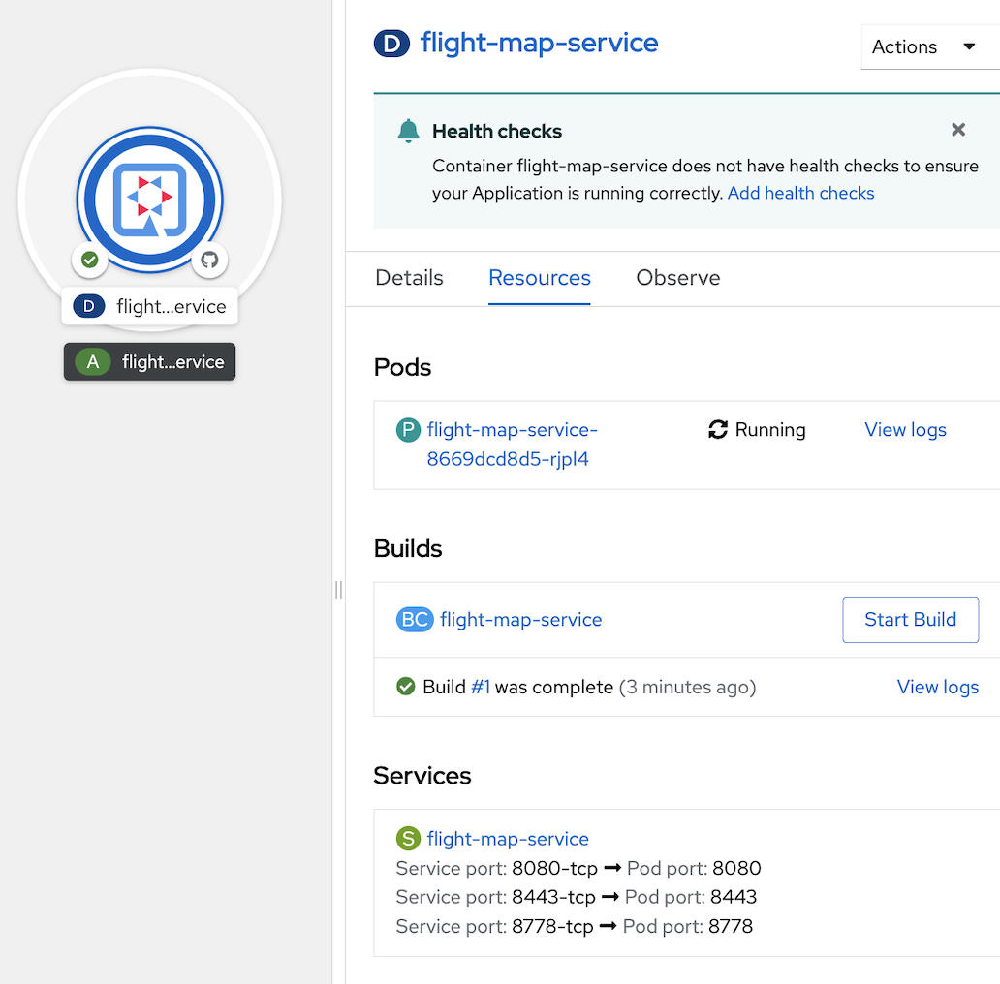
   - after build complete, flight-data-simulater circle will change to dark blue color, click view logs in Pods section to view application log, Verify that there are no errors
   
8. Create Route for flight-map-service
   - click Project in left menu, select Project: \<your username\>-flight
   - in Overview tab, scroll down to Inventory section, select Route
   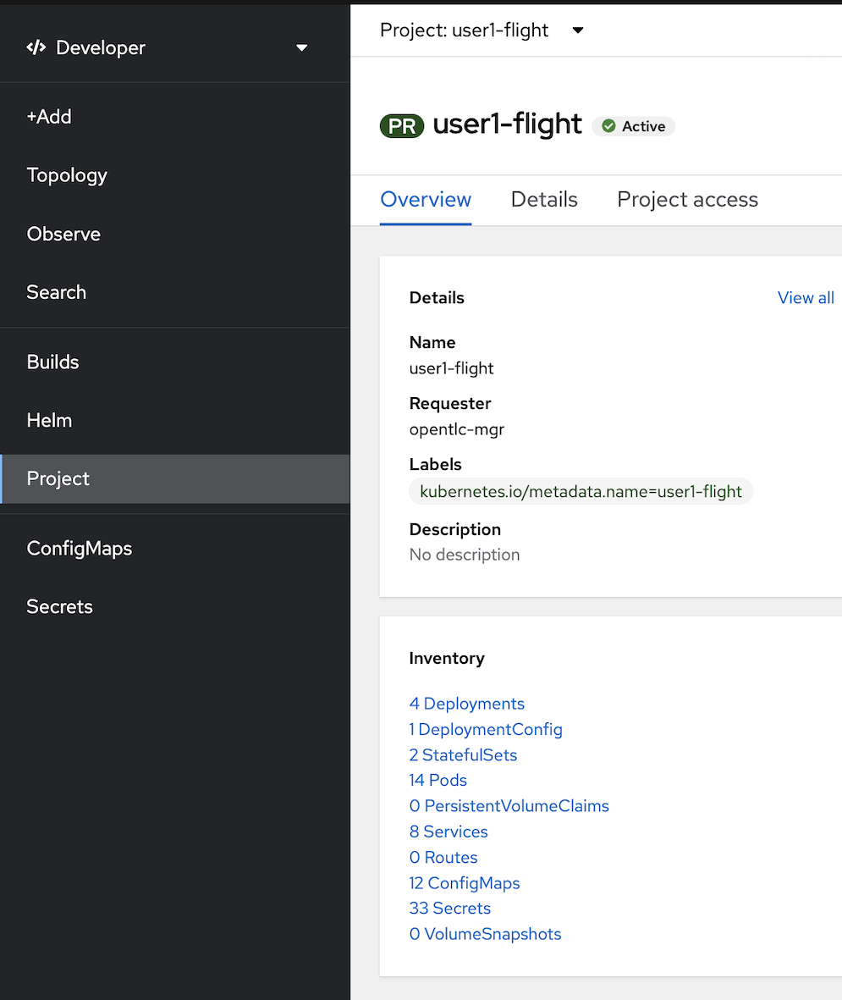
   - in Route page, click Create Route
   
   - in create route page, leave all default except:
     - name: flight-map-service
     - Service: select flight-map-service
     - target port: 8080-->8080(TCP)
     - uncheck secure route, click create
      
      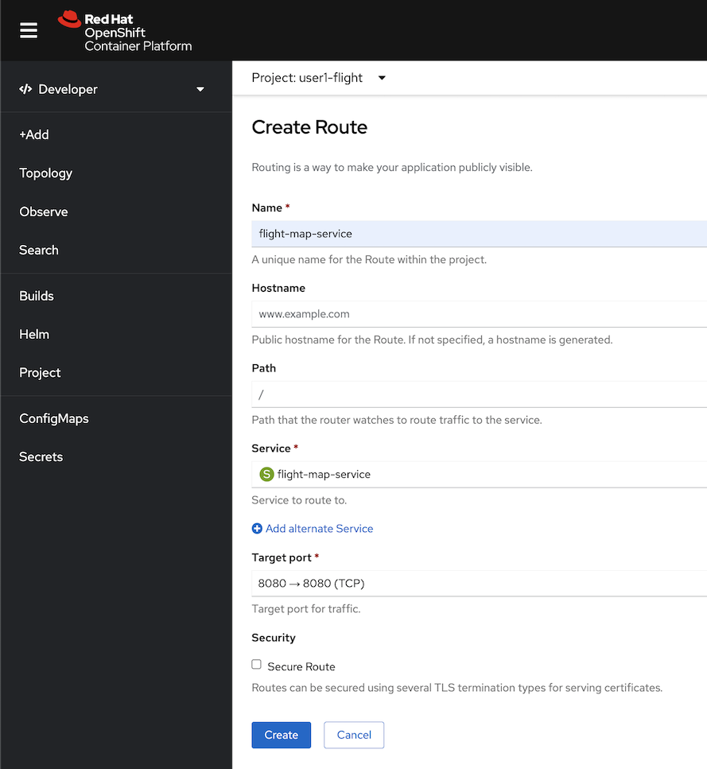
      
   - back to topology view, in flight-map-service, You will see a route icon in the top right corner of flight-map-service circle (or click flight-map-service circle and see details in flight-map-service deployment information page, resources tab)
   
9. (Optional) Change Icon and Add Connection Info in Topology (add more information in Topology)
   - back to Topology view (click Topology in left menu)
   - click flight-data-simulator circle, in (D) flight-data-simulator deployment information, select details tab
   - scroll down to Labels section click edit link
   - in edit labels popup, remove label "app.openshift.io/runtime=java" (click x icon)
   - type "app.openshift.io/runtime=quarkus" to add new icon to this deployment, click save
   - verify flight-data-simulator change icon from duke to quarkus
      
      

   - Repeat with the other components as follows:
     - flight-map-service, remove label "app.openshift.io/runtime=java", add label "app.openshift.io/runtime=quarkus"
     - postgresql, add label "app.openshift.io/runtime=postgresql"
   - add connection to topology (For cosmetic purposes only, not a real conneciton between components.), click web terminal icon at top right conner (">_" icon) 
      
      
   
   - wait until command line terminal show in buttom of developer console
      
      

   - set current project to your project ('\<your username\>-flight') such as user1-flight
     
     ```bash
     oc project <your username>-flight
     ```
     sample output

     ```bash
     Now using project "user1-flight" on server "https://172.30.0.1:443".
     ```
   - set connection with oc annotate command, type below command in web terminal
     
     ```bash
     oc annotate deployment flight-map-service 'app.openshift.io/connects-to=[{"apiVersion":"apps.openshift.io/v1","kind":"DeploymentConfig","name":"postgresql"},{"apiVersion":"apps/v1","kind":"Deployment","name":"flight-data-simulator"},{"apiVersion":"kafka.strimzi.io/v1beta2","kind":"Kafka","name":"my-cluster"}]' 
     oc annotate deployment flight-data-simulator 'app.openshift.io/connects-to=[{"apiVersion":"kafka.strimzi.io/v1beta2","kind":"Kafka","name":"my-cluster"}]' 
     oc annotate deployment flight-data-aggregator 'app.openshift.io/connects-to=[{"apiVersion":"kafka.strimzi.io/v1beta2","kind":"Kafka","name":"my-cluster"}]' 
     ```

   - check result in topology view
      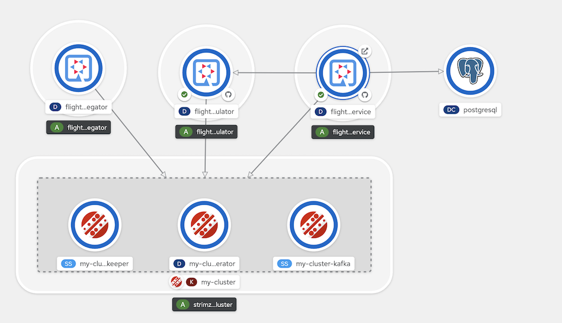

10. Test Live Flight Track Demo
   - in topology view, click route icon of flight-map-service for open web application
   - browser will show Live Flight Tracer demo
      
      
   
   - click checkbox show slifht creation form and show websocket log
      
      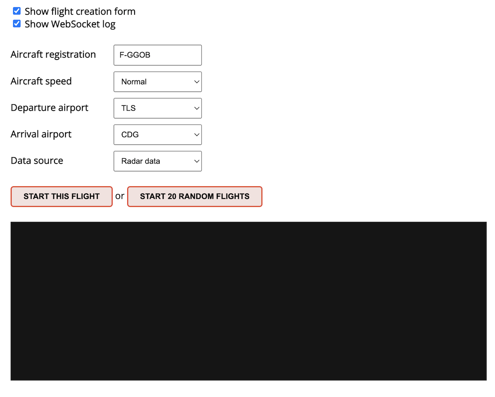
   - click start this flight button or start 20 random flights button and see simulation in your browser
      
      


